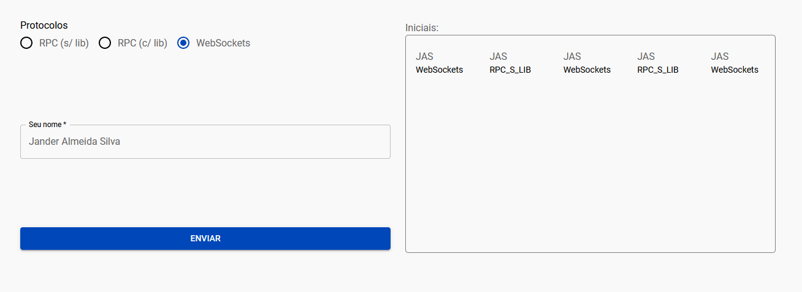

# sd_sockets_api

💻 Atividade de implementação de protocolos TCP/RPC e Socket da Disciplina de Sistemas Distribuidos.

<figure align="center">
    
</figure>

## 💡: Funcionalidades
Foram desenvolvidos 3 servidores.
1. Servidor RPC desenvolvido na Linguagem C
2. Servidor gRPC utilizando NodeJs
3. Servidor HTTP utilizando NodeJs e WebSockets

A aplicação permite o usuário escolher o protocolo/tecnologia que será responsável por lidar com a requisição, digitar o seu nome e receber as iniciais desse nome e qual o protocolo utilizado.

## :rocket: Tecnologias
- [NodeJs](https://nodejs.org/pt-br/)
